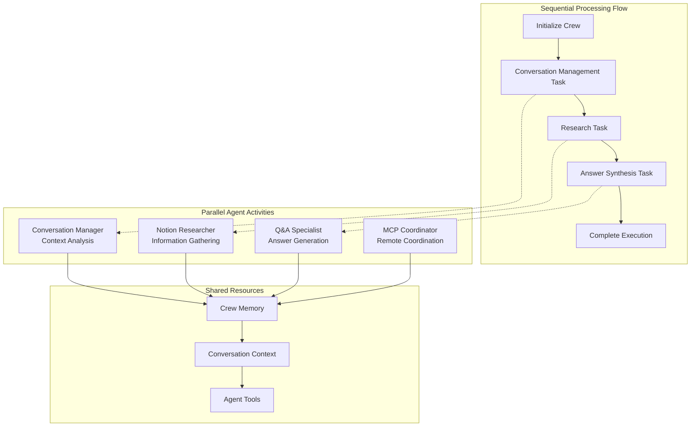
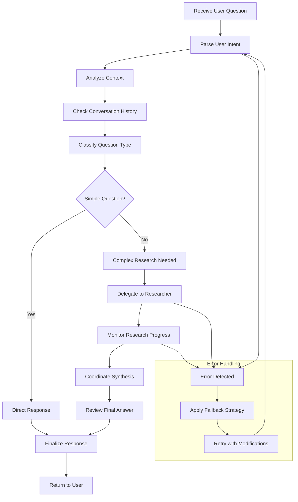
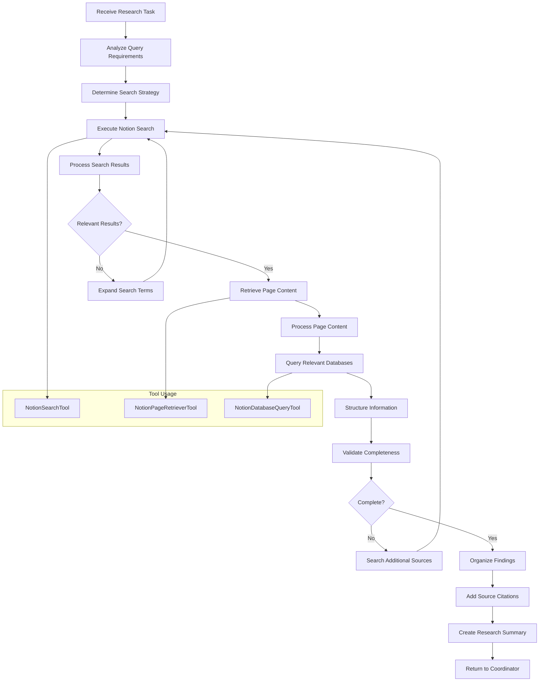
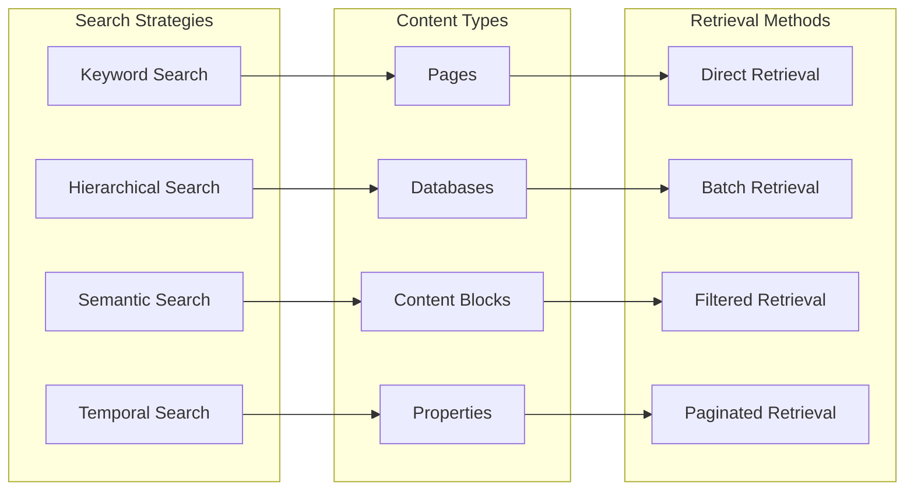
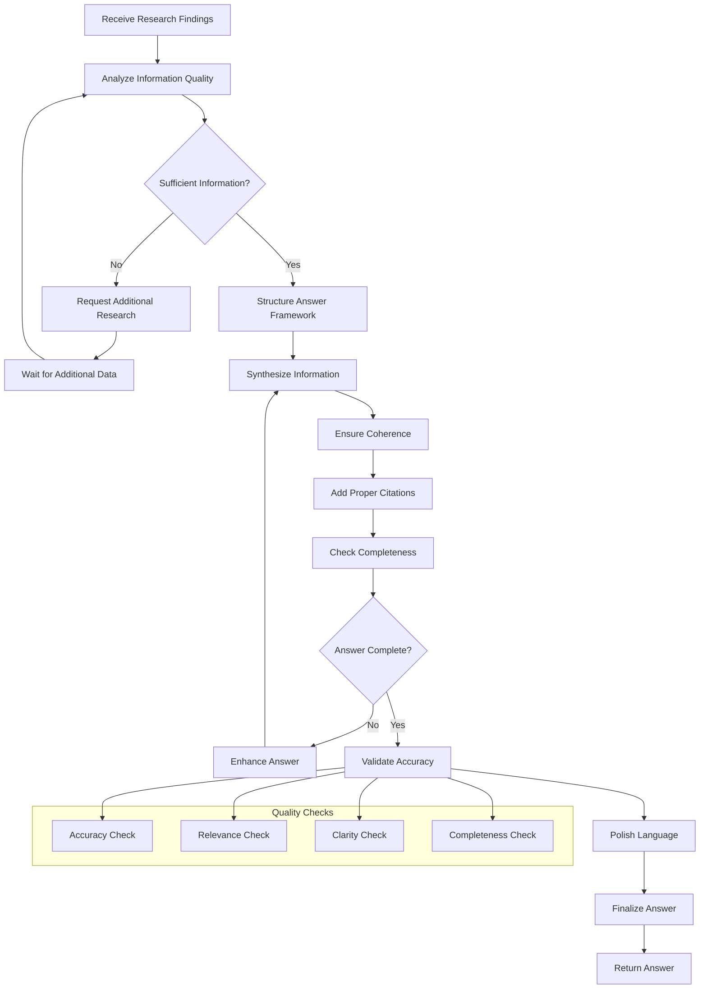
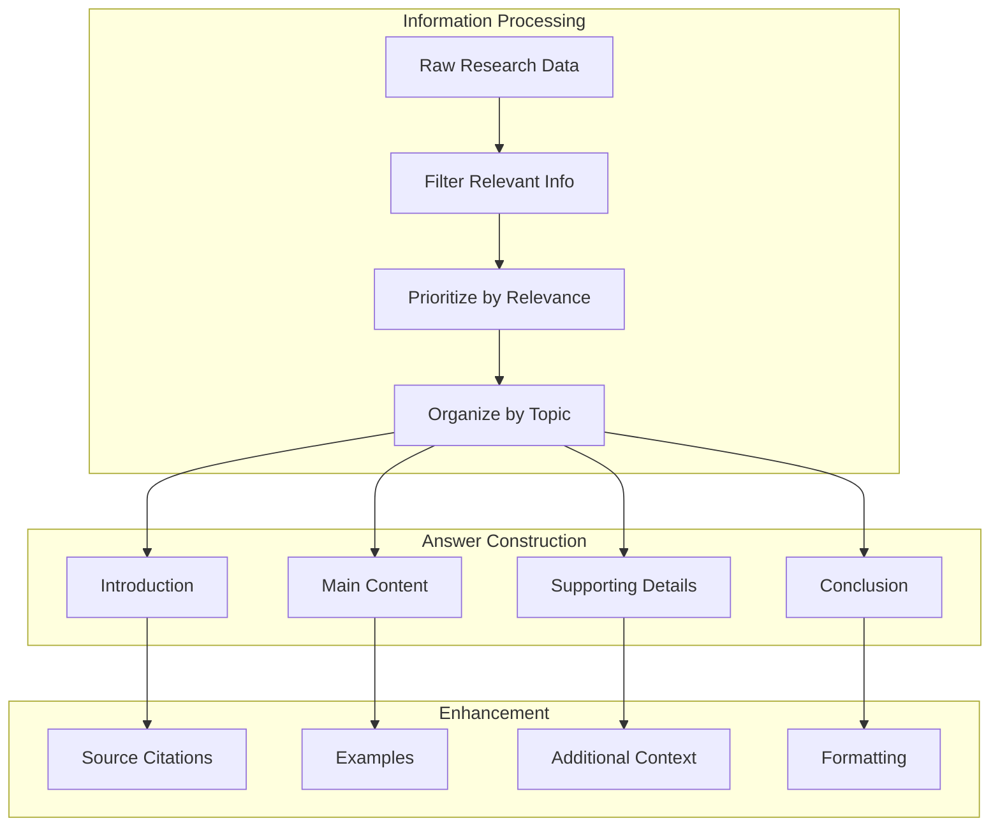
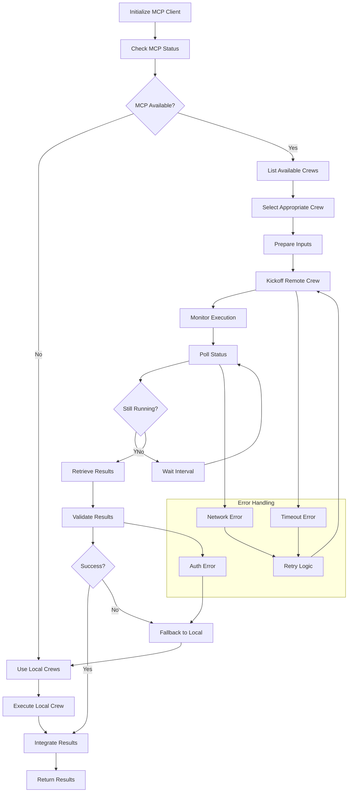
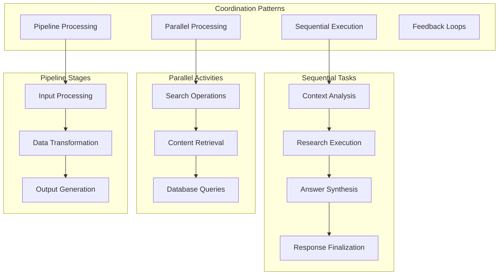
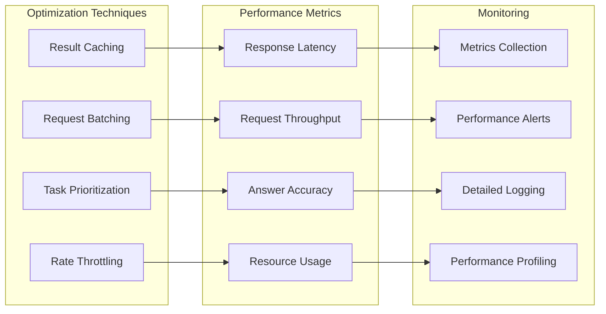
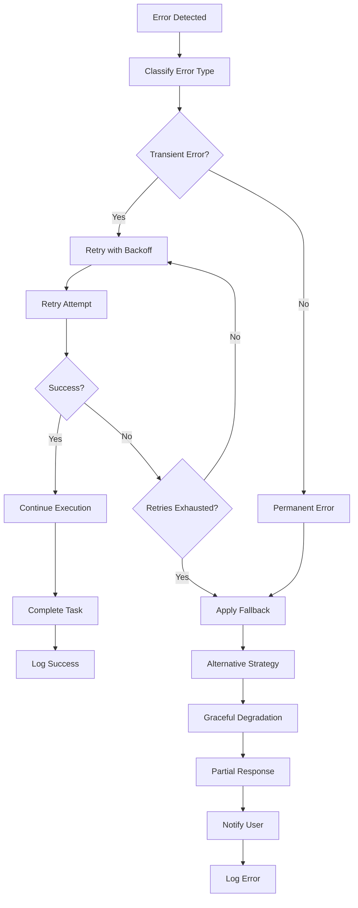

# Agent Workflows and Task Execution

This document details the specific workflows and task execution patterns used by each agent in the CrewAI Notion Chatbot system.

## Overview

The multi-agent system executes tasks through carefully orchestrated workflows where each agent has specific responsibilities and execution patterns. The system uses CrewAI's sequential processing model with intelligent task delegation and result synthesis.

## Workflow Execution Model

## Conversation Manager Workflow

The Conversation Manager acts as the orchestrator, understanding user intent and coordinating the overall response strategy.

### Conversation Manager Tasks

1. **Intent Analysis**
   - Natural language understanding
   - Question classification
   - Context extraction
   - Priority assessment

2. **Coordination**
   - Task delegation
   - Progress monitoring
   - Result integration
   - Quality assurance

3. **Context Management**
   - Conversation history tracking
   - Context preservation
   - Follow-up handling
   - Session management

## Notion Researcher Workflow

The Notion Researcher is responsible for gathering comprehensive information from the Notion workspace.

### Research Strategies

## Q&A Specialist Workflow

The Q&A Specialist synthesizes research findings into comprehensive, well-structured answers.

### Answer Synthesis Process

## MCP Coordinator Workflow

The MCP Coordinator manages integration with CrewAI Enterprise services and handles remote crew execution.

## Task Coordination Patterns

The system uses several coordination patterns to ensure efficient task execution and result integration.

## Performance Optimization Strategies

Each agent implements specific optimization strategies to ensure efficient execution.

## Error Recovery Workflows

The system implements comprehensive error recovery mechanisms at each workflow stage.

This comprehensive workflow documentation provides detailed insights into how each agent operates within the multi-agent system, ensuring reliable and efficient question-answering capabilities for the CrewAI Notion Chatbot.
