# MCP Integration and Enterprise Deployment

This document provides comprehensive details about the Model Context Protocol (MCP) integration in the CrewAI Notion Chatbot, including enterprise deployment strategies and local development patterns.

## MCP Overview

The Model Context Protocol (MCP) is a standardized protocol that enables AI systems to connect with external tools and data sources. In our system, MCP serves as the bridge between local CrewAI crews and enterprise-grade CrewAI deployments.

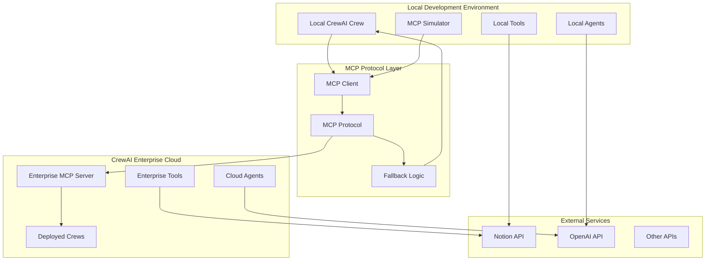

## MCP Client Architecture

The MCP client provides a unified interface for both local and enterprise crew execution, with intelligent fallback mechanisms.

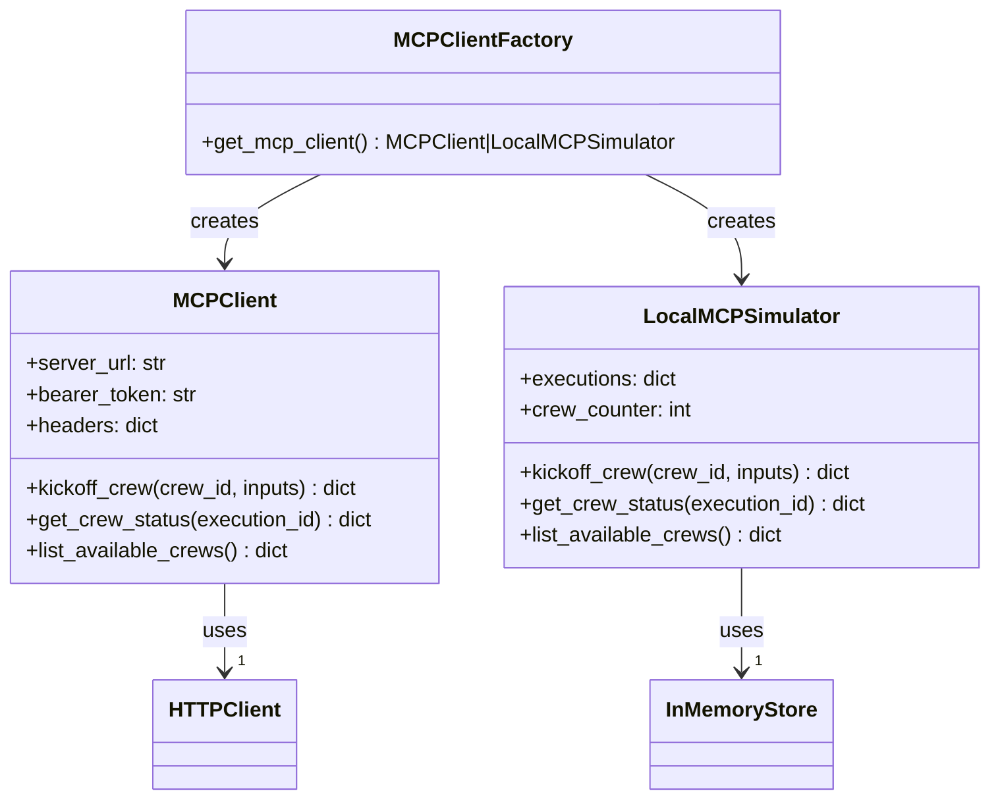

## Enterprise Deployment Flow

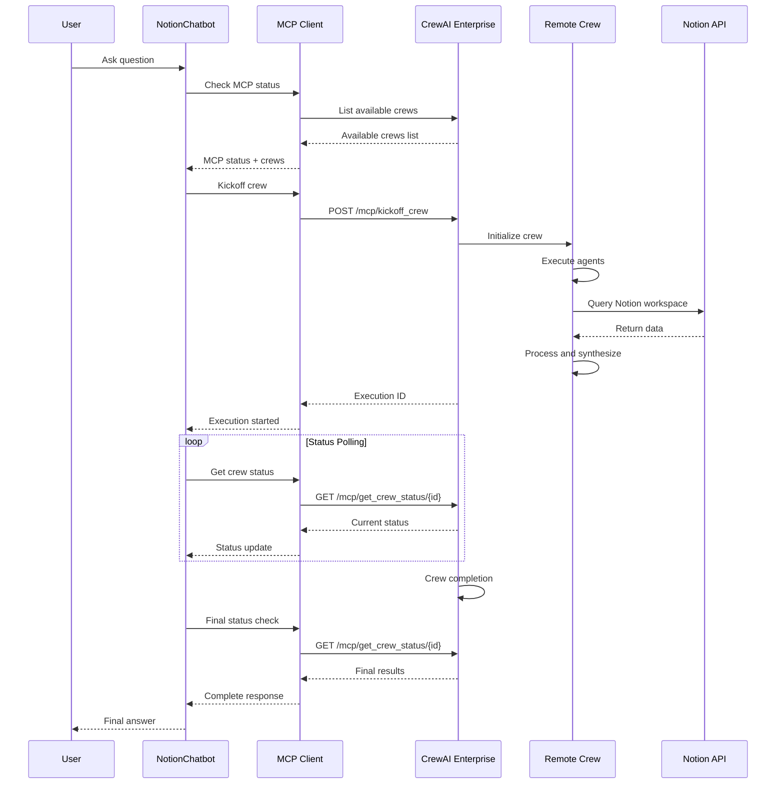

## Local Development Flow

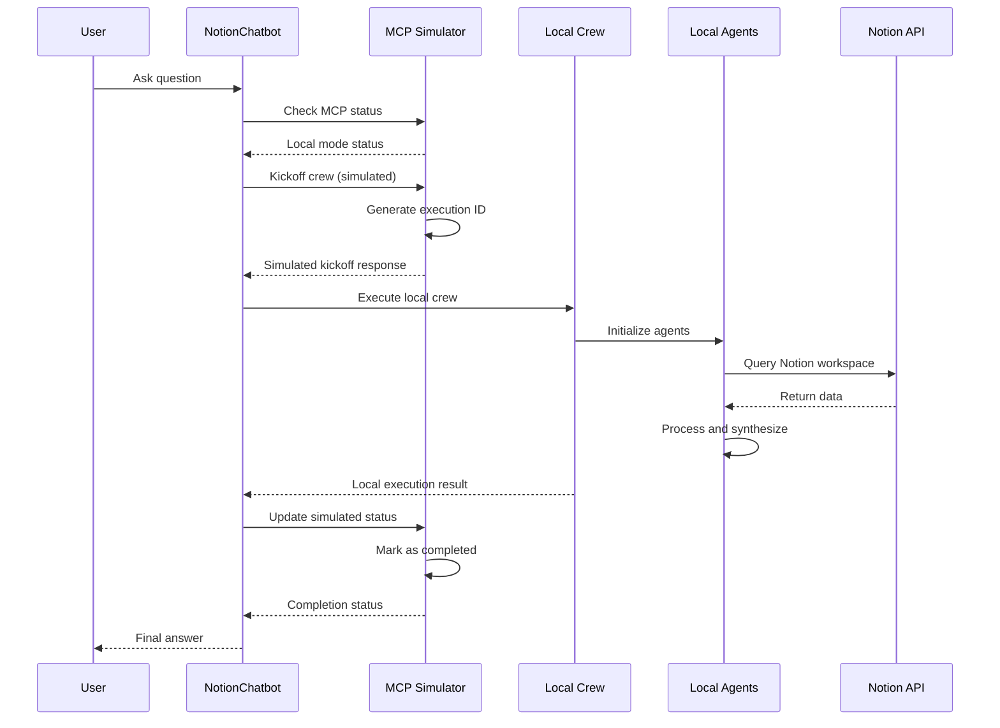

## Fallback Mechanisms

The system implements multiple layers of fallback to ensure reliability across different deployment scenarios.

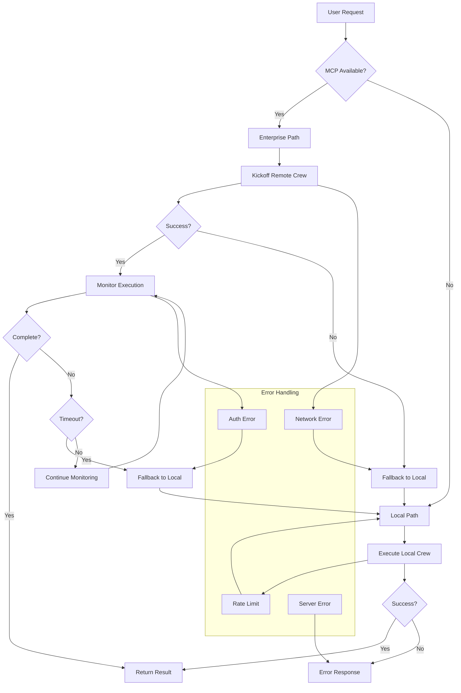

## Configuration Management

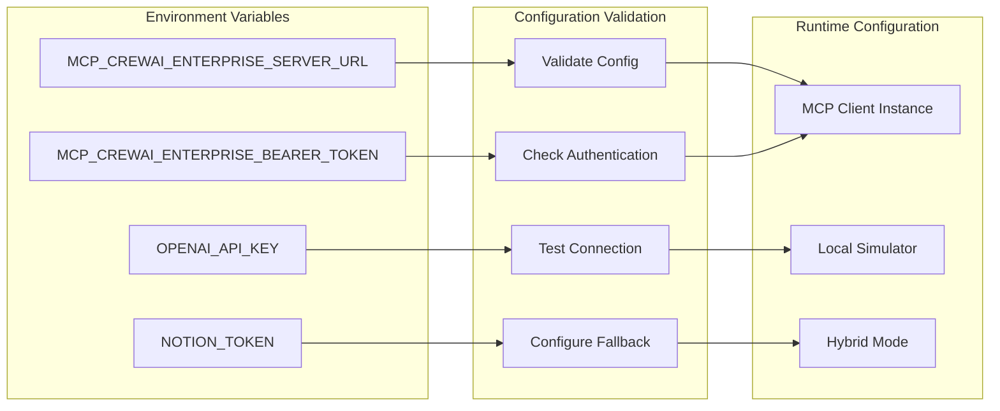

## Enterprise Crew Management

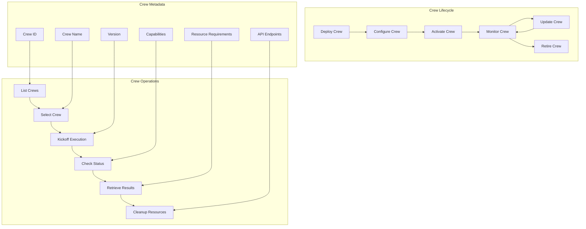

## Performance Monitoring

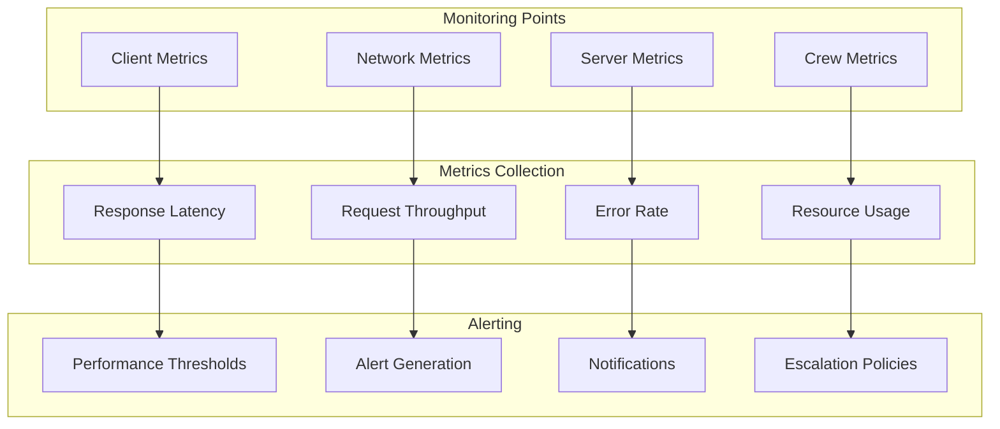

## Security Considerations

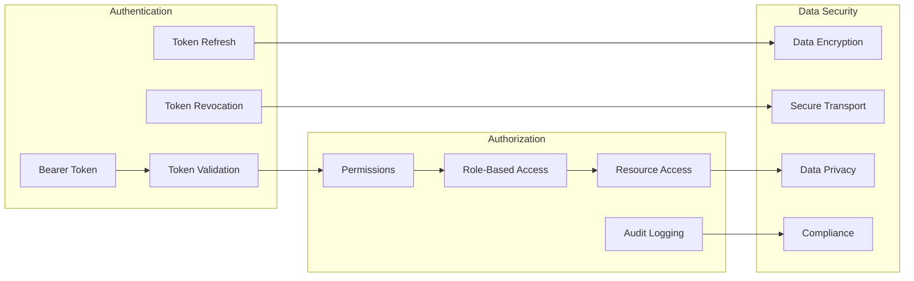

## Deployment Strategies

### Development Environment
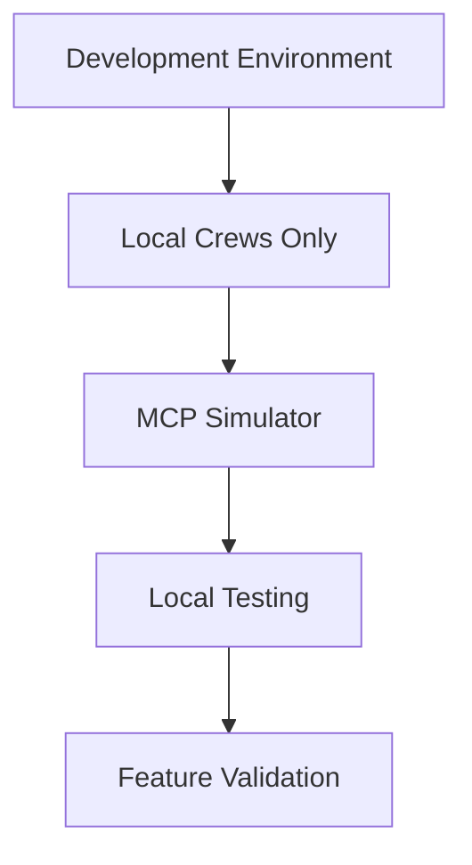

### Staging Environment
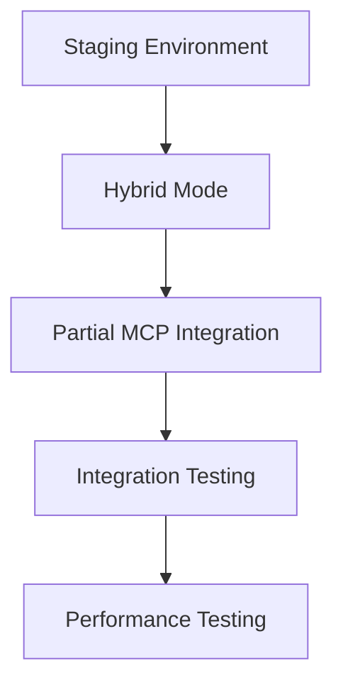

### Production Environment
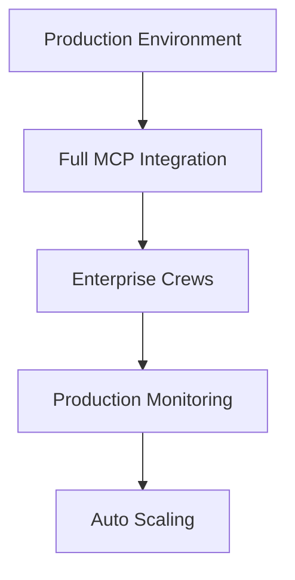

## Troubleshooting Guide

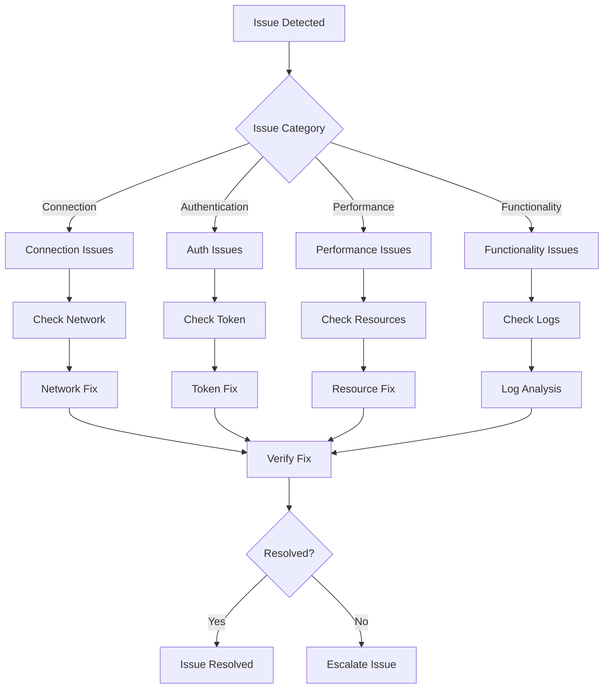

This comprehensive MCP integration documentation provides detailed insights into how the CrewAI Notion Chatbot seamlessly integrates with enterprise deployments while maintaining robust local development capabilities.
