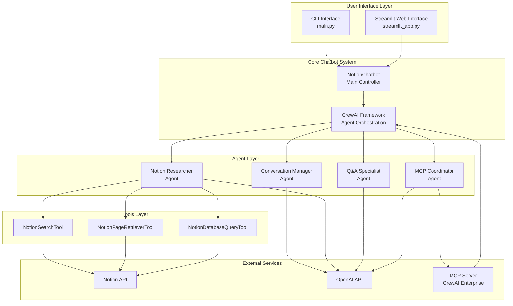
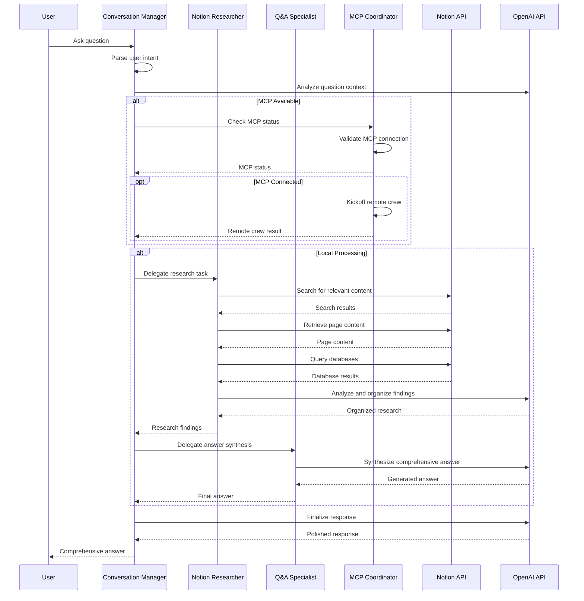
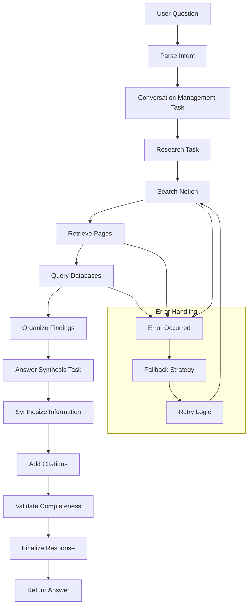
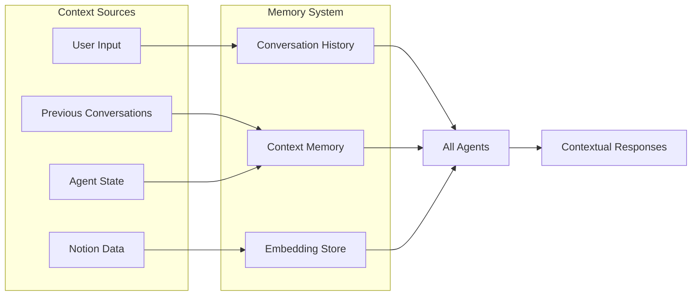
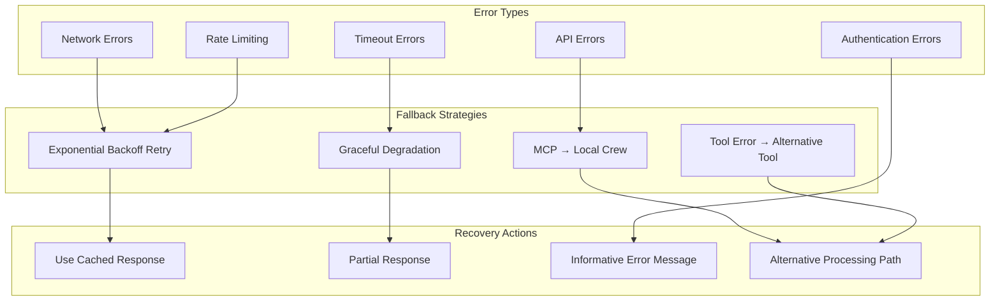
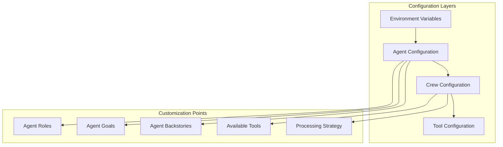

# Multi-Agent Architecture Overview

This document provides a comprehensive overview of the CrewAI Notion Chatbot's multi-agent architecture, including agent roles, interactions, and system flow.

## System Architecture

The CrewAI Notion Chatbot employs a sophisticated multi-agent system where specialized AI agents collaborate to answer questions about Notion workspace content. The system is designed with modularity, scalability, and fault tolerance in mind.

## Agent Roles and Responsibilities

### 1. Conversation Manager Agent
**Role**: Orchestrates the overall conversation flow and ensures user queries are properly understood and addressed.

**Responsibilities**:
- Parse and understand user intent
- Maintain conversation context
- Coordinate with other agents
- Manage conversation history
- Handle follow-up questions

**Key Characteristics**:
- **Delegation Enabled**: Can delegate tasks to other agents
- **Max Iterations**: 2 (focused on coordination)
- **Tools**: None (pure coordination role)

### 2. Notion Researcher Agent
**Role**: Specialized in researching and retrieving relevant information from Notion workspace.

**Responsibilities**:
- Search through Notion pages and databases
- Retrieve specific page content
- Query databases for structured information
- Organize and summarize findings
- Provide source citations

**Key Characteristics**:
- **Delegation Disabled**: Focused execution role
- **Max Iterations**: 3 (allows thorough research)
- **Tools**: NotionSearchTool, NotionPageRetrieverTool, NotionDatabaseQueryTool

### 3. Q&A Specialist Agent
**Role**: Synthesizes information from research and provides comprehensive answers.

**Responsibilities**:
- Analyze research findings
- Synthesize information from multiple sources
- Generate clear, structured responses
- Provide proper citations
- Ensure answer completeness

**Key Characteristics**:
- **Delegation Disabled**: Focused on answer generation
- **Max Iterations**: 2 (focused on synthesis)
- **Tools**: None (works with provided information)

### 4. MCP Coordinator Agent
**Role**: Manages integration with CrewAI Enterprise MCP services.

**Responsibilities**:
- Coordinate with MCP services
- Monitor crew deployments
- Handle MCP-specific workflows
- Manage fallback scenarios
- Integrate remote crew results

**Key Characteristics**:
- **Delegation Disabled**: Specialized coordination role
- **Max Iterations**: 2 (focused on MCP operations)
- **Tools**: None (uses MCP client directly)

## Agent Interaction Flow

## Task Flow and Processing

The system processes user queries through a series of well-defined tasks that are executed sequentially by the appropriate agents.

## Memory and Context Management

The system maintains context and memory across conversations to provide coherent, contextual responses.

## Error Handling and Resilience

The system implements multiple layers of error handling and fallback mechanisms to ensure reliability.

## Performance Optimization

The system includes several optimization strategies to ensure efficient operation.

### Agent Optimization
- **Iteration Limits**: Each agent has optimized iteration limits to prevent infinite loops
- **Role Specialization**: Agents are specialized for specific tasks to improve efficiency
- **Delegation Strategy**: Strategic delegation to minimize redundant processing

### Tool Optimization
- **Caching**: Results are cached to avoid redundant API calls
- **Batch Processing**: Multiple operations are batched when possible
- **Rate Limiting**: Built-in rate limiting to respect API constraints

### Memory Optimization
- **Embedding Storage**: Efficient vector storage for context retrieval
- **History Pruning**: Automatic pruning of old conversation history
- **Context Compression**: Intelligent context compression for large conversations

## Configuration and Customization

The multi-agent system is highly configurable to adapt to different use cases and requirements.

## Scalability Considerations

The architecture is designed to scale both horizontally and vertically:

### Horizontal Scaling
- **Agent Distribution**: Agents can be distributed across multiple processes
- **MCP Integration**: Enterprise deployments can handle multiple concurrent crews
- **Load Balancing**: Requests can be load-balanced across multiple instances

### Vertical Scaling
- **Resource Allocation**: Agents can be allocated more computational resources
- **Model Scaling**: More powerful language models can be used for complex tasks
- **Memory Scaling**: Memory systems can be expanded for larger contexts

This multi-agent architecture provides a robust, scalable, and maintainable foundation for the CrewAI Notion Chatbot, enabling sophisticated question-answering capabilities while maintaining system reliability and performance.
