# CrewAI Notion Chatbot - User Guide

A comprehensive guide for working with the CrewAI Notion Chatbot application, from initial setup to advanced usage patterns.

## Table of Contents

1. [Quick Start](#quick-start)
2. [Prerequisites](#prerequisites)
3. [Installation and Setup](#installation-and-setup)
4. [Configuration](#configuration)
5. [Usage Patterns](#usage-patterns)
6. [Interface Options](#interface-options)
7. [Best Practices](#best-practices)
8. [Advanced Features](#advanced-features)
9. [Troubleshooting](#troubleshooting)
10. [Development Workflow](#development-workflow)
11. [Performance Optimization](#performance-optimization)
12. [Security Guidelines](#security-guidelines)

## Quick Start

### For Impatient Users 🚀

```bash
# 1. Clone and navigate
git clone <repository-url>
cd vcd-crewai-windsurf-example

# 2. Install dependencies
pip install -r requirements.txt

# 3. Set up environment
cp .env.example .env
# Edit .env with your API keys

# 4. Test setup
python test_chatbot.py

# 5. Start chatting
python main.py
# OR
streamlit run src/streamlit_app.py
```

## Prerequisites

### System Requirements


### API Account Setup

#### 1. OpenAI API Key
1. Visit [OpenAI Platform](https://platform.openai.com)
2. Create account or sign in
3. Navigate to API Keys section
4. Create new secret key
5. Copy and save securely

#### 2. Notion Integration Token
1. Go to [Notion Integrations](https://developers.notion.com)
2. Create new integration
3. Give it appropriate permissions
4. Copy the integration secret
5. Add integration to your Notion pages/databases

#### 3. CrewAI Enterprise (Optional)
1. Contact CrewAI for enterprise access
2. Obtain server URL and bearer token
3. Configure for production deployment

## Installation and Setup

### Step 1: Environment Setup

```bash
# Create virtual environment (recommended)
python -m venv venv

# Activate virtual environment
# Windows:
venv\Scripts\activate
# macOS/Linux:
source venv/bin/activate

# Install dependencies
pip install -r requirements.txt
```

### Step 2: Configuration

```bash
# Copy environment template
cp .env.example .env

# Edit .env file with your actual values
notepad .env  # Windows
nano .env     # Linux/macOS
```

### Step 3: Validation

```bash
# Run comprehensive test
python test_chatbot.py

# Expected output:
# ✅ Environment validation passed
# ✅ MCP client initialization successful
# ✅ Notion tools validation passed
# ✅ Chatbot initialization successful
# ✅ Simple query test passed
```

## Configuration

### Environment Variables Reference

```env
# Required - OpenAI API Configuration
OPENAI_API_KEY=sk-your-openai-api-key-here

# Required - Notion Integration
NOTION_TOKEN=secret_your-notion-integration-token

# Optional - Notion Database (for specific database queries)
NOTION_DATABASE_ID=your-database-id-here

# Optional - CrewAI Enterprise MCP Integration
MCP_CREWAI_ENTERPRISE_SERVER_URL=https://your-crewai-server.com
MCP_CREWAI_ENTERPRISE_BEARER_TOKEN=your-bearer-token

# Optional - CrewAI Configuration
CREWAI_TELEMETRY_OPT_OUT=true
```

### Configuration Validation Flow

```mermaid
flowchart TD
    START[Start Application] --> CHECK_ENV[Check Environment Variables]
    CHECK_ENV --> OPENAI_KEY{OpenAI Key Valid?}
    
    OPENAI_KEY -->|No| ERROR_OPENAI[❌ OpenAI Key Missing/Invalid]
    OPENAI_KEY -->|Yes| NOTION_KEY{Notion Token Valid?}
    
    NOTION_KEY -->|No| ERROR_NOTION[❌ Notion Token Missing/Invalid]
    NOTION_KEY -->|Yes| MCP_CHECK{MCP Configured?}
    
    MCP_CHECK -->|Yes| MCP_VALIDATE[Validate MCP Connection]
    MCP_CHECK -->|No| LOCAL_MODE[✅ Local Mode Ready]
    
    MCP_VALIDATE --> MCP_SUCCESS{MCP Valid?}
    MCP_SUCCESS -->|Yes| ENTERPRISE_MODE[✅ Enterprise Mode Ready]
    MCP_SUCCESS -->|No| FALLBACK[⚠️ Fallback to Local Mode]
    
    ERROR_OPENAI --> EXIT[Exit with Error]
    ERROR_NOTION --> EXIT
    LOCAL_MODE --> READY[🚀 Application Ready]
    ENTERPRISE_MODE --> READY
    FALLBACK --> READY
```



## Usage Patterns

### Basic Question-Answer Flow


### Common Question Types

#### 1. Information Retrieval
```
Examples:
- "What are the key points from my meeting notes?"
- "Show me all tasks marked as high priority"
- "What's the status of Project Alpha?"
```

#### 2. Content Search
```
Examples:
- "Find all pages about machine learning"
- "Search for budget information from last quarter"
- "What documentation exists for the API?"
```

#### 3. Database Queries
```
Examples:
- "List all incomplete tasks"
- "Show me contacts from the sales team"
- "What are the upcoming deadlines?"
```

#### 4. Contextual Questions
```
Examples:
- "Based on my project notes, what are the next steps?"
- "Summarize the key decisions from recent meetings"
- "What are the main risks identified in my planning docs?"
```

## Interface Options

### 1. Command Line Interface (CLI)

```bash
python main.py
```

**Features:**
- Direct terminal interaction
- Conversation history
- MCP status display
- Simple and fast

**Best for:**
- Quick queries
- Development and testing
- Automated scripts
- Power users

### 2. Streamlit Web Interface

```bash
streamlit run src/streamlit_app.py
```

**Features:**
- Modern web UI
- Visual status indicators
- Chat history with styling
- Environment status panel
- Setup instructions

**Best for:**
- Regular users
- Visual feedback
- Demonstration purposes
- Team sharing

### Interface Comparison

```mermaid
graph LR
    subgraph "CLI Interface"
        CLI_SPEED[⚡ Fast Startup]
        CLI_SIMPLE[🎯 Simple Commands]
        CLI_SCRIPT[🤖 Scriptable]
        CLI_LIGHT[💡 Lightweight]
    end
    
    subgraph "Web Interface"
        WEB_VISUAL[👁️ Visual Interface]
        WEB_STATUS[📊 Status Dashboard]
        WEB_HISTORY[📜 Rich History]
        WEB_SHARE[🔗 Shareable]
    end
    
    subgraph "Use Cases"
        DEVELOPMENT[Development]
        PRODUCTION[Production]
        DEMO[Demonstrations]
        TEAM[Team Usage]
    end
    
    CLI_SPEED --> DEVELOPMENT
    CLI_SCRIPT --> DEVELOPMENT
    WEB_VISUAL --> PRODUCTION
    WEB_STATUS --> DEMO
    WEB_SHARE --> TEAM
```



## Best Practices

### 1. Question Formulation

#### ✅ Good Questions
```
- "What are the key deliverables mentioned in the Q4 planning documents?"
- "Find all meeting notes from last week that mention budget concerns"
- "List the technical requirements from the API specification pages"
```

#### ❌ Avoid These
```
- "Tell me everything" (too broad)
- "What's good?" (vague)
- "Fix this" (no context)
```

### 2. Notion Workspace Organization

```mermaid
graph TB
    subgraph "Recommended Structure"
        ROOT[Workspace Root]
        PROJECTS[📁 Projects]
        MEETINGS[📁 Meeting Notes]
        DOCS[📁 Documentation]
        TASKS[📊 Task Database]
        CONTACTS[📊 Contact Database]
    end
    
    ROOT --> PROJECTS
    ROOT --> MEETINGS
    ROOT --> DOCS
    ROOT --> TASKS
    ROOT --> CONTACTS
    
    subgraph "Page Organization"
        TITLES[Clear Titles]
        TAGS[Consistent Tags]
        DATES[Date Structure]
        LINKS[Internal Links]
    end
    
    PROJECTS --> TITLES
    MEETINGS --> TAGS
    DOCS --> DATES
    TASKS --> LINKS
```



### 3. Performance Tips

#### Optimize Your Queries
- Be specific about timeframes
- Use clear topic keywords
- Reference specific databases when needed
- Break complex questions into parts

#### Workspace Optimization
- Keep pages well-titled
- Use consistent tagging
- Maintain database properties
- Regular content organization

### 4. Security Best Practices


## Advanced Features

### 1. MCP Enterprise Integration

For production deployments with CrewAI Enterprise:

```bash
# Configure enterprise settings
export MCP_CREWAI_ENTERPRISE_SERVER_URL="https://your-server.com"
export MCP_CREWAI_ENTERPRISE_BEARER_TOKEN="your-token"

# Run with enterprise features
python main.py --use-mcp
```

### 2. Custom Tool Integration

Extend the chatbot with custom tools:

```python
# Example: Custom database tool
from crewai_tools import BaseTool

class CustomDatabaseTool(BaseTool):
    name: str = "Custom Database Query"
    description: str = "Query custom database"
    
    def _run(self, query: str) -> str:
        # Your custom implementation
        return query_results
```

### 3. Batch Processing

Process multiple queries efficiently:

```python
# Example batch processing
questions = [
    "What are this week's priorities?",
    "Show me budget updates",
    "List pending approvals"
]

for question in questions:
    response = chatbot.answer_question(question)
    print(f"Q: {question}\nA: {response}\n---")
```

### 4. Custom Agents

Extend with specialized agents:

```python
from crewai import Agent

custom_agent = Agent(
    role="Domain Expert",
    goal="Provide specialized domain knowledge",
    backstory="Expert in specific domain with deep knowledge",
    tools=[domain_specific_tool],
    verbose=True
)
```

## Troubleshooting

### Common Issues and Solutions

#### 1. Authentication Errors


#### 2. Connection Issues

**Problem:** Cannot connect to Notion or OpenAI
**Solutions:**
- Check internet connection
- Verify API endpoints are accessible
- Check firewall settings
- Validate API key formats

#### 3. Performance Issues

**Problem:** Slow response times
**Solutions:**
- Reduce query complexity
- Optimize Notion workspace structure
- Check API rate limits
- Consider using MCP for enterprise scaling

#### 4. Empty or Poor Results

**Problem:** Chatbot returns no results or irrelevant information
**Solutions:**
- Improve question specificity
- Check Notion content organization
- Verify integration permissions
- Review search terms and keywords

### Debug Mode

Enable detailed logging for troubleshooting:

```bash
# Set debug environment
export CREWAI_LOG_LEVEL=DEBUG

# Run with verbose output
python main.py --verbose
```

### Log Analysis

```mermaid
graph TB
    subgraph "Log Levels"
        DEBUG[🔍 DEBUG - Detailed traces]
        INFO[ℹ️ INFO - General information]
        WARNING[⚠️ WARNING - Potential issues]
        ERROR[❌ ERROR - Execution errors]
    end
    
    subgraph "Log Sources"
        AGENTS[Agent Activities]
        TOOLS[Tool Executions]
        API[API Calls]
        MCP[MCP Communications]
    end
    
    DEBUG --> AGENTS
    INFO --> TOOLS
    WARNING --> API
    ERROR --> MCP
```



## Development Workflow

### 1. Local Development Setup

```bash
# Development environment
git clone <repository>
cd vcd-crewai-windsurf-example

# Create feature branch
git checkout -b feature/new-capability

# Set up development environment
python -m venv dev-env
source dev-env/bin/activate  # or dev-env\Scripts\activate on Windows
pip install -r requirements.txt

# Configure for development
cp .env.example .env.dev
# Edit .env.dev with development settings
```

### 2. Testing Workflow

```bash
# Run comprehensive tests
python test_chatbot.py

# Test specific components
python -c "from src.notion_tools import NotionSearchTool; print('Tools OK')"
python -c "from src.agents import get_notion_researcher; print('Agents OK')"
python -c "from src.crews import NotionChatbot; print('Crews OK')"
```

### 3. Git Workflow (Following User Rules)

```bash
# Always rebase to develop before creating feature branch
git checkout develop
git pull origin develop
git checkout -b feature/new-feature

# Work on feature
git add .
git commit -m "feat: add new feature"

# Before merging, rebase to develop
git checkout develop
git pull origin develop
git checkout feature/new-feature
git rebase develop

# Merge (not rebase) into develop
git checkout develop
git merge feature/new-feature
git push origin develop
```

### 4. Code Quality Guidelines


## Performance Optimization

### 1. Query Optimization

```python
# Optimize queries for better performance
def optimize_query_strategy(question: str) -> str:
    """Optimize query based on question type"""
    if "recent" in question.lower():
        # Add date filters
        return f"{question} in the last 30 days"
    elif "urgent" in question.lower():
        # Prioritize by urgency
        return f"{question} priority:high"
    return question
```

### 2. Caching Strategy


### 3. Resource Management

- **Memory:** Monitor agent memory usage
- **API Calls:** Implement rate limiting
- **Network:** Optimize request batching
- **Storage:** Clean up temporary files

## Security Guidelines

### 1. API Key Management


### 2. Data Privacy

- **Notion Data:** Ensure proper access controls
- **Conversation History:** Implement data retention policies
- **Logs:** Sanitize sensitive information
- **Transmission:** Use encrypted connections

### 3. Access Control

```python
# Example access control implementation
class AccessController:
    def __init__(self):
        self.user_permissions = {}
    
    def check_access(self, user_id: str, resource: str) -> bool:
        permissions = self.user_permissions.get(user_id, [])
        return resource in permissions
    
    def grant_access(self, user_id: str, resource: str):
        if user_id not in self.user_permissions:
            self.user_permissions[user_id] = []
        self.user_permissions[user_id].append(resource)
```

## Conclusion

This comprehensive guide provides everything you need to effectively work with the CrewAI Notion Chatbot. From basic setup to advanced enterprise deployment, follow these guidelines to maximize the application's potential while maintaining security and performance.

### Quick Reference

- **Setup:** Install dependencies → Configure .env → Test → Run
- **CLI Usage:** `python main.py`
- **Web Usage:** `streamlit run src/streamlit_app.py`
- **Testing:** `python test_chatbot.py`
- **Documentation:** Check `docs/` folder for detailed technical docs

### Getting Help

1. Check this user guide first
2. Review technical documentation in `docs/`
3. Run the test script to validate setup
4. Check logs for detailed error information
5. Review troubleshooting section for common issues

Happy chatting with your Notion workspace! 🚀
